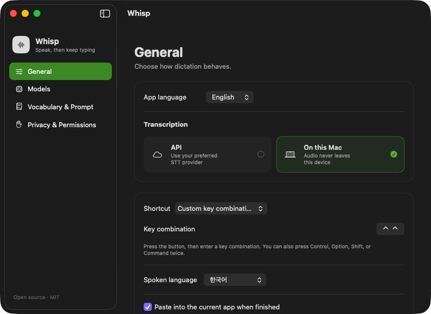

# Whisp

[English](README.md) | [한국어](README.ko.md)

Whisp is a small, open-source macOS dictation app. Double-tap Control, speak, and double-tap Control again to type the transcript into the field you were using.

It is designed as a focused mac dictation app: one global shortcut, a compact live waveform, remote or fully local speech-to-text, and no transcript history.

<p align="center">
  
</p>

## Features

- Double-tap Control to start and stop dictation by default
- Custom keyboard shortcuts and double-modifier shortcuts
- Compact floating waveform with native Liquid Glass on macOS 26
- Vercel AI Gateway, OpenAI, xAI Grok, Groq, and custom OpenAI-compatible STT
- Fully local transcription through `whisper.cpp`
- Tiny, Base, and Small local model management
- Custom vocabulary and transcription prompts
- Korean and English interface localization
- Direct insertion into the previously focused text field, with clipboard fallback
- API keys stored only in macOS Keychain
- Sparkle-signed update checks from the menu bar
- No saved audio or transcript history

## Download

[Download the latest Whisp DMG](https://github.com/kmelon55/whisp/releases/latest/download/Whisp.dmg).

1. Open `Whisp.dmg`.
2. Drag **Whisp** into **Applications**.
3. Launch Whisp and grant the permissions required by the features you use.

The current public build (`v0.3.1`) is ad-hoc signed and has not been notarized with an Apple Developer ID. macOS may therefore block its first launch. Future tagged releases are configured to require Developer ID signing and Apple notarization before publication.

If macOS blocks this version:

1. Try to open Whisp once and dismiss the warning.
2. Open **System Settings → Privacy & Security**.
3. Scroll down to **Security** and click **Open Anyway** next to the Whisp message.
4. Authenticate if prompted, then confirm **Open**.

Use this System Settings flow rather than Control-clicking or right-clicking the app.

After installing this release, Whisp can check for future versions automatically. You can also choose **Check for Updates…** from its menu bar menu.

## Requirements

- macOS 14 Sonoma or later
- Apple silicon Mac
- Microphone permission
- Accessibility permission for direct text insertion and double-modifier global shortcuts
- `whisper.cpp` only when using local transcription

## Quick start

1. Open Whisp.
2. Choose a remote STT provider or download a local model.
3. Double-tap **Control** to start recording.
4. Speak.
5. Double-tap **Control** again to transcribe and insert the text.

The shortcut can be changed or disabled in **Whisp → General**.

## Remote transcription

Open **Whisp → Models → Remote STT**, select a provider, and save its API key.

| Provider | Default model or API | Endpoint style |
| --- | --- | --- |
| Vercel | `openai/gpt-4o-mini-transcribe` | Vercel AI Gateway transcription |
| OpenAI | `gpt-4o-mini-transcribe` | `/v1/audio/transcriptions` |
| xAI Grok | `grok-transcribe` | `/v1/stt` |
| Groq | `whisper-large-v3-turbo` | OpenAI-compatible transcription |
| Custom | `whisper-1` | Custom OpenAI-compatible endpoint |

Audio is sent only to the provider selected for the current transcription. Provider credentials remain in macOS Keychain.

## Local transcription

Install `whisper.cpp` first:

```bash
brew install whisper-cpp
```

Then open **Whisp → Models**, download a model, and select **On this Mac** under Transcription.

| Model | Approximate size | Best for |
| --- | ---: | --- |
| Tiny | 75 MB | Fast, short notes |
| Base | 142 MB | Recommended everyday balance |
| Small | 466 MB | Better Korean accuracy |

Local models are stored in `~/Library/Application Support/Whisp/Models`. Local-mode recordings never leave the Mac.

## Raycast and URL scheme

Whisp supports this URL:

```bash
open 'whisp://toggle'
```

To let Raycast own the shortcut, set Whisp's shortcut to **None** and connect the URL command to a Raycast Script Command or Shell Command.

## Privacy

- Temporary recordings are deleted after transcription.
- Whisp does not keep a transcript history.
- Remote-mode audio is sent only to the selected STT provider.
- Local mode runs through `whisper.cpp` without a transcription network request.
- API keys are stored in macOS Keychain.

## Build from source

Requirements: Swift 5.10 or later and an Xcode toolchain with the macOS SDK.

```bash
git clone https://github.com/kmelon55/whisp.git
cd whisp
./Scripts/build-app.sh
open dist/Whisp.app
```

To create the distributable DMG:

```bash
./Scripts/package-release.sh
```

The local app bundle is ad-hoc signed. Tagged GitHub releases require Developer ID signing, Apple notarization, and stapling, and additionally include a Sparkle EdDSA signature in `appcast.xml`. See [Release Guide](docs/RELEASING.md).

## Project structure

```text
Sources/Whisp/
├── Core/       App state, settings, Keychain, and text cleanup
├── Services/   Audio, transcription, shortcuts, and text insertion
└── UI/         Settings and floating dictation overlay
```

Whisp uses SwiftUI, AppKit, AVFoundation, Carbon, and Sparkle.

## Tests

```bash
swift build
./Scripts/test-core.sh
```

Microphone capture, global shortcuts, direct insertion, and provider transcription require an app-bundle smoke test. Remote provider tests can use your API key and incur provider costs, so they are not run automatically.

## License

Whisp is available under the [MIT License](LICENSE).
