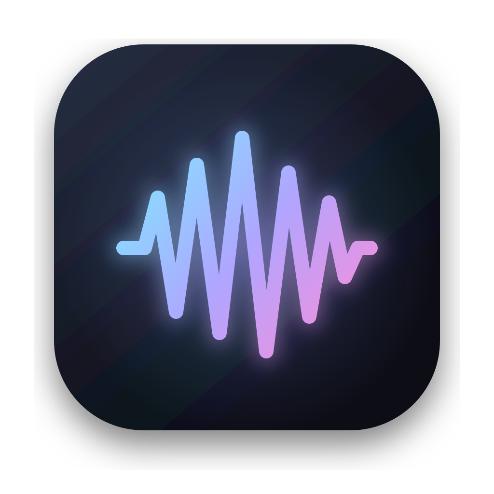
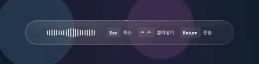

# Whisp

[English](README.md) | [한국어](README.ko.md)

<p align="center">
  
</p>

Whisp is a small, open-source macOS dictation app. Double-tap Control, speak, and double-tap Control again to type the transcript into the field you were using.

It is designed as a focused mac dictation app: one global shortcut, a compact live waveform, remote or fully local speech-to-text, and no transcript history.

<p align="center">
  
</p>

## Features

- Double-tap Control to start and stop dictation by default
- Custom keyboard shortcuts and double-modifier shortcuts
- Compact floating waveform with native Liquid Glass on macOS 26
- Vercel AI Gateway, OpenAI, xAI Grok, Groq, and custom OpenAI-compatible STT
- Fully local transcription through `whisper.cpp`
- Tiny, Base, and Small local model management
- Custom vocabulary and transcription prompts
- Korean and English interface localization
- Direct insertion into the previously focused text field, with clipboard fallback
- Configure or disable separate while-recording shortcuts for cancel, paste, and paste-and-Enter
- Input-source-independent physical key labels and guarded single-modifier actions
- A persistent loading waveform with optional shortcut hints and transcription status
- Optional launch at login, with shortcut recovery after wake and session unlock
- API keys stored only in macOS Keychain
- Automatic Sparkle-signed update checks, alerts, and optional background downloads
- No saved audio or transcript history

## Download

[Download the latest Whisp DMG](https://github.com/kmelon55/whisp/releases/latest/download/Whisp.dmg).

1. Open `Whisp.dmg`.
2. Drag **Whisp** into **Applications**.
3. Launch Whisp and grant the permissions required by the features you use.

The current public build (`v0.4.0`) is ad-hoc signed and has not been notarized with an Apple Developer ID. macOS may therefore block its first launch. Release archives are still signed with Sparkle EdDSA so existing installations can verify and install in-app updates.

If macOS blocks this version:

1. Try to open Whisp once and dismiss the warning.
2. Open **System Settings → Privacy & Security**.
3. Scroll down to **Security** and click **Open Anyway** next to the Whisp message.
4. Authenticate if prompted, then confirm **Open**.

Use this System Settings flow rather than Control-clicking or right-clicking the app.

After installing this release, Whisp checks for future versions automatically and shows a signed Sparkle update alert when one is available. In **Whisp → General → Startup & Updates**, you can disable automatic checks, enable background downloads, check immediately, or launch Whisp automatically when you sign in. Whisp remains running across normal sleep and wake; it also refreshes its global shortcuts after wake or session unlock.

## Requirements

- macOS 14 Sonoma or later
- Apple silicon Mac
- Microphone permission
- Accessibility permission for direct text insertion and double-modifier global shortcuts
- `whisper.cpp` only when using local transcription

## Quick start

1. Open Whisp.
2. Choose a remote STT provider or download a local model.
3. Double-tap **Control** to start recording.
4. Speak.
5. Double-tap **Control** again to transcribe and insert the text.

The start shortcut and the separate cancel, paste, and paste-and-Enter actions can be changed or disabled in **Whisp → General**. While-recording actions may use an ordinary key combination or a guarded single press of Control, Option, Shift, or Command. Physical keys are always labeled using the US/English layout even when another input source is active.

For example, keep double-Control as the start/paste shortcut and assign a single Control press to **Paste & Enter**. Whisp waits briefly to distinguish one press from a double-tap, and ignores the single-modifier action when that modifier is used with another key or a mouse click.

## Startup and updates

- **Launch Whisp at login** uses the macOS Login Items service and is opt-in.
- Whisp stays active through normal sleep/wake and refreshes its global shortcut listeners after wake and session unlock.
- Automatic update checks and update alerts are enabled by default.
- Automatic background download is optional and can be changed independently in Settings.
- **Check Now…** in Settings and **Check for Updates…** in the menu bar both open Sparkle's standard signed update flow.

If macOS marks the login item as requiring approval, use the **Open Settings** button beside the option and allow Whisp in **System Settings → General → Login Items & Extensions**.

## Remote transcription

Open **Whisp → Models → Remote STT**, select a provider, and save its API key.

| Provider | Default model or API | Endpoint style |
| --- | --- | --- |
| Vercel | `openai/gpt-4o-mini-transcribe` | Vercel AI Gateway transcription |
| OpenAI | `gpt-4o-mini-transcribe` | `/v1/audio/transcriptions` |
| xAI Grok | `grok-transcribe` | `/v1/stt` |
| Groq | `whisper-large-v3-turbo` | OpenAI-compatible transcription |
| Custom | `whisper-1` | Custom OpenAI-compatible endpoint |

Audio is sent only to the provider selected for the current transcription. Provider credentials remain in macOS Keychain.

## Local transcription

Install `whisper.cpp` first:

```bash
brew install whisper-cpp
```

Then open **Whisp → Models**, download a model, and select **On this Mac** under Transcription.

| Model | Approximate size | Best for |
| --- | ---: | --- |
| Tiny | 75 MB | Fast, short notes |
| Base | 142 MB | Recommended everyday balance |
| Small | 466 MB | Better Korean accuracy |

Local models are stored in `~/Library/Application Support/Whisp/Models`. Local-mode recordings never leave the Mac.

## Raycast and URL scheme

Whisp supports this URL:

```bash
open 'whisp://toggle'
```

To let Raycast own the shortcut, set Whisp's shortcut to **None** and connect the URL command to a Raycast Script Command or Shell Command.

## Privacy

- Temporary recordings are deleted after transcription.
- Whisp does not keep a transcript history.
- Remote-mode audio is sent only to the selected STT provider.
- Local mode runs through `whisper.cpp` without a transcription network request.
- API keys are stored in macOS Keychain.

## Build from source

Requirements: Swift 5.10 or later and an Xcode toolchain with the macOS SDK.

```bash
git clone https://github.com/kmelon55/whisp.git
cd whisp
./Scripts/build-app.sh
open dist/Whisp.app
```

To create the distributable DMG:

```bash
./Scripts/package-release.sh
```

The local app bundle is ad-hoc signed. Tagged GitHub releases always include a Sparkle EdDSA signature in `appcast.xml`; when Apple credentials are configured, they additionally require Developer ID signing, notarization, and stapling. See [Release Guide](docs/RELEASING.md).

## Project structure

```text
Sources/Whisp/
├── Core/       App state, settings, Keychain, and text cleanup
├── Services/   Audio, transcription, shortcuts, and text insertion
└── UI/         Settings and floating dictation overlay
```

Whisp uses SwiftUI, AppKit, AVFoundation, Carbon, and Sparkle.

## Tests

```bash
swift build
./Scripts/test-core.sh
```

Microphone capture, global shortcuts, direct insertion, and provider transcription require an app-bundle smoke test. Remote provider tests can use your API key and incur provider costs, so they are not run automatically.

## License

Whisp is available under the [MIT License](LICENSE).
